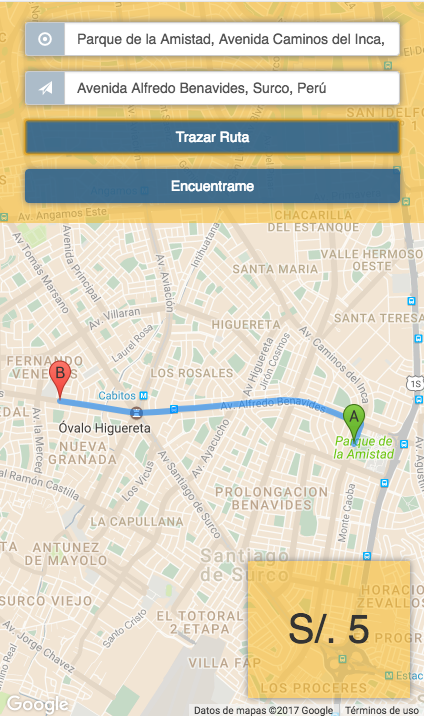
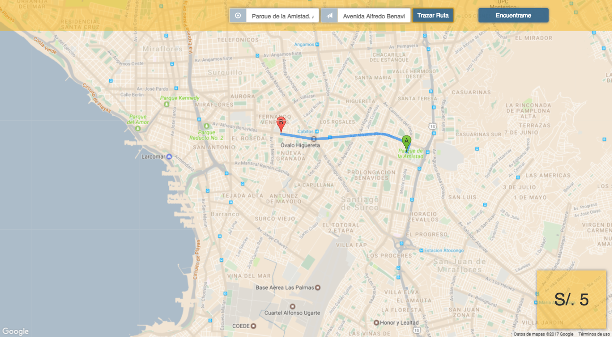

# App In Route | API (Application Programming Interface)

Gracias a la API de google Maps y la API de geolocation haremos nuestro servicio de taxis.
Esta aplicación tendra la funcionalidad de asignar un punto de partida y otro punto de llegada,
para luego trazar la ruta más corta basándonos en el algoritmo de dijkstra.
Además utilizaremos Bootstrap para la implementación del diseño empezando con Mobile First. 

[Proyecto Finalizado](https://fiorellaqa.github.io/App-InRoute/)

## Versión Mobile

## Versión Desktop

